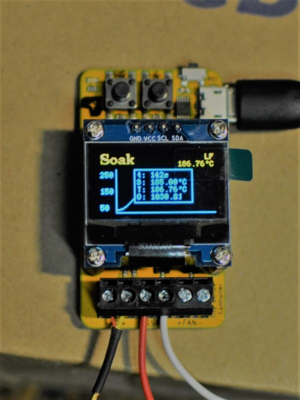
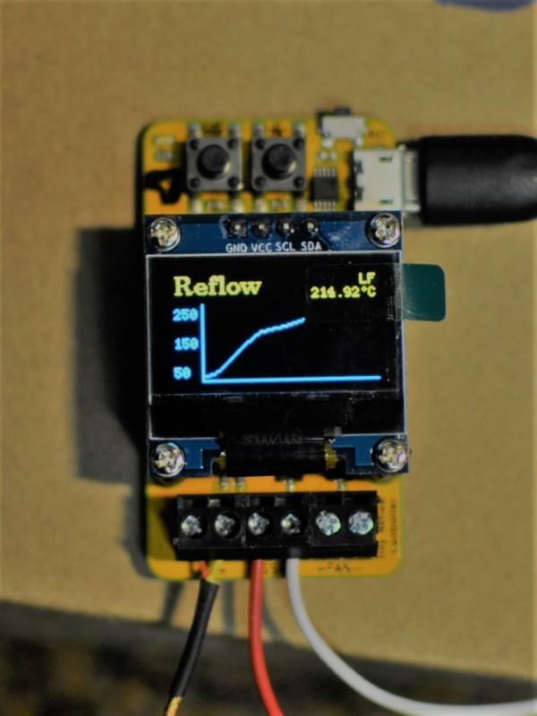
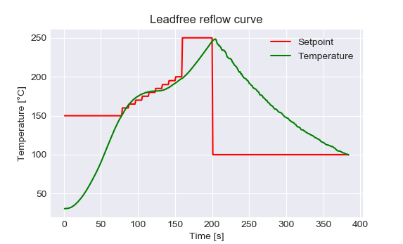

# Tiny Reflow Controller - Alternate Firmware
> A firmware mod for the Tiny Reflow Controller v2.0




## WARNING
THIS PROJECT INVOLVES USING VOLTAGE LEVELS THAT CAN CAUSE SERIOUS INJURIES OR DEATH.  
PLEASE USE EXTREME CAUTION, ENSURE YOU HAVE SUFFICIENT KNOWLEDGE OR SEEK FOR ASSISTANCE IF YOU ARE UNSURE ABOUT WHAT YOU ARE DOING.  
NONE OF THE AUTHORS OR CONTRIBUTORS ASSOCIATED WITH THIS PROJECT CAN BE HELD LIABLE FOR YOUR USE OF THE INFORMATION PROVIDED HERE.

## Description
This is a firmware for the Arduino (pro mini) compatible [Tiny Reflow Controller][tiny-reflow-controller-url] by Rocket Scream Electronics.  
A big portion of the code is copied over from the [example code][tiny-reflow-controller-github] provided by Rocket Scream.  
New features have been added, such as the possibility to have an arbitrary number of reflow profiles, some display improvements and the use of the available fan output for cooling.

## Features
 * Build with PlatformIO
 * Compatible with hardware v2.0 only
 * Uses U8g2 library for display management
 * Additional data display screens and (auto-)scrolling reflow curve
 * Interrupt-based button debouncing, allows for more complex interactions (single click, doucle click, hold...)
 * Arbitrary number of profiles (e.g. for low-temp Sn-Bi solder paste, or baking components for moisture removal)
 * A baking profile will hold temperature (80°C, customizable) until user cancels
 * Fan can be used for cooldown - _Not tested_
 * ...

## Usage
 * A short click on **Start/Stop** will start the reflow process with the selected profile.  
 * During reflow, a long click (>1s) on **Start/Stop** will abort the reflow process.  
 * A short click on **LF/PB** during idle will switch to the next available reflow profile. During reflow, this will toggle the overlay data display (with elapsed time, setpoint, temperature and PID output).

## TODO
 - [ ] PID tunings for the bake profile(s) require further adjustment, very conservative tunings are required in order to limit overshoot
 - [ ] Fan control has not been tested (auto activation at cooldown)
 - [ ] Manual fan actuation may be implemented in the future, either for temperature homogenization during reflow or for cooldown


## Example of Lead-Free Reflow Curve
```
  Temperature (Degree Celcius)                 Magic Happens Here!
  245-|                                               x  x
      |                                            x        x
      |                                         x              x
      |                                      x                    x
  200-|                                   x                          x
      |                              x    |                          |   x
      |                         x         |                          |       x
      |                    x              |                          |
  150-|               x                   |                          |
      |             x |                   |                          |
      |           x   |                   |                          |
      |         x     |                   |                          |
      |       x       |                   |                          |
      |     x         |                   |                          |
      |   x           |                   |                          |
  30 -| x             |                   |                          |
      |<  60 - 90 s  >|<    90 - 120 s   >|<       90 - 120 s       >|
      | Preheat Stage |   Soaking Stage   |       Reflow Stage       | Cool
   0  |_ _ _ _ _ _ _ _|_ _ _ _ _ _ _ _ _ _|_ _ _ _ _ _ _ _ _ _ _ _ _ |_ _ _ _ _
                                                                 Time (Seconds)
                    Information copied from the original firmware.
```

Here is an example of a reflow curve achieved with a Tiny Reflow Controller v2.0 running the present firmware.  



Additional information on recommended reflow profile can be found online, in you solder specifications or application notes fromthe chip manufacturers.

## Licence
This Tiny Reflow Controller firmware is released under the **Creative Commons Share Alike** v4.0 license (CC-BY-SA)

See LICENSE file or http://creativecommons.org/licenses/by-sa/4.0/

## Credits
 * [Rocket Scream Electronics][rocketscream-url] (Phang Moh, Lim) original designer and author of the [Tiny Reflow Controller][tiny-reflow-controller-url]
 * [Arduino PID library](https://github.com/br3ttb/Arduino-PID-Library), by Brett Beauregard
 * [MAX31856 library](https://github.com/adafruit/Adafruit_MAX31856), by Limor Fried of Adafruit
 * [U8g2 display library](https://github.com/olikraus/u8g2), by Olikraus
 * [ClickEncoder](https://github.com/0xPIT/encoder), by 0xPIT, on which the button debouncing routine is heavily based
 * [TimerOne](https://github.com/PaulStoffregen/TimerOne), by Paul Stoffregen
 * and probably many others...


<!-- Markdwon links -->
[tiny-reflow-controller-url]: https://www.rocketscream.com/blog/product/tiny-reflow-controller-v2/
[tiny-reflow-controller-github]: https://github.com/rocketscream/TinyReflowController
[rocketscream-url]: http://www.rocketscream.com

